#  FolderView3 for Unraid 7+

Organize your Docker containers and VMs into collapsible folders on the Docker, VM, and Dashboard tabs.

## Features

- **Collapsible folders** on Docker, VM, and Dashboard tabs
- **Dashboard layouts** — Classic, Full-width Panel, Accordion, Inset Panel, and Embossed views with per-section settings for Docker and VMs

  | Accordion | Full-width | Inset | Embossed |
  |:-:|:-:|:-:|:-:|
  | 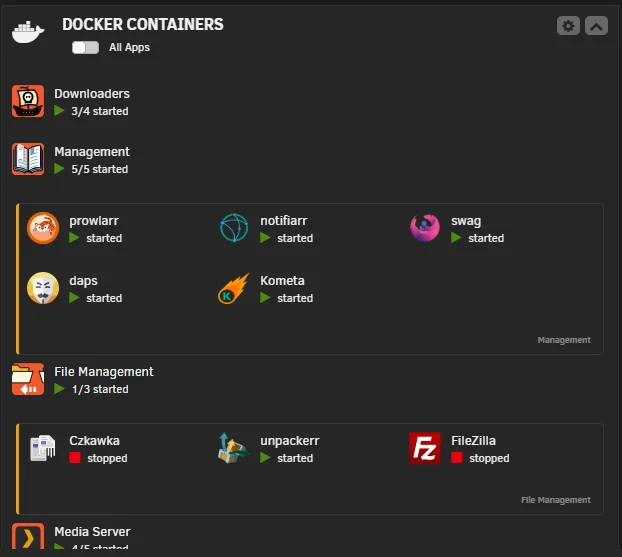 | 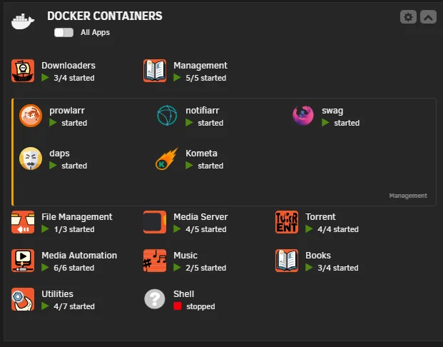 | 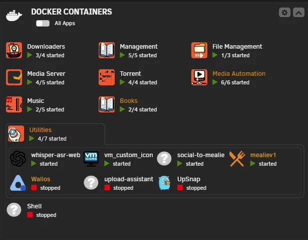 | 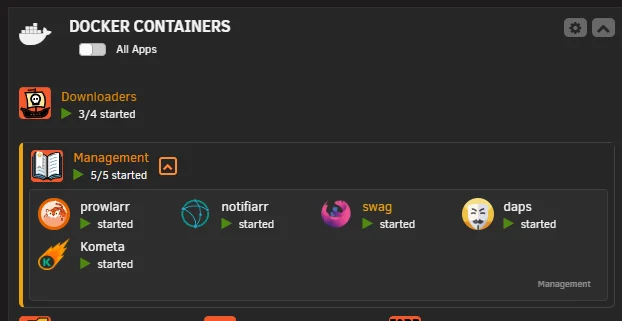 |
- **Expand/collapse animation** with optional greyscale dimming of collapsed folders
- **Docker label assignment** — add `folder.view3: "FolderName"` to any container or Compose service to auto-assign
- **Per-folder colors** — customize border, vertical bar, and row separator colors with optional color locking
- **Custom actions** — define folder-level actions (start, stop, cycle, restart, or run User Scripts) that appear in the right-click context menu
- **Folder WebUI** — set a custom URL per folder that opens from the context menu
- **Preview overflow** — Default, Expand Row, or Scroll behavior with row separators

  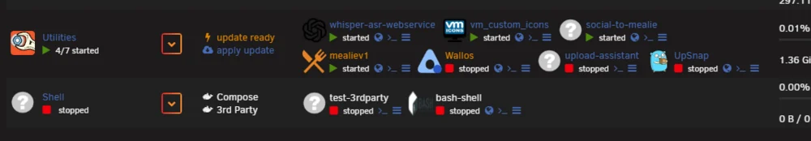

- **Hide from preview** — selectively hide containers from the collapsed preview while keeping them visible when expanded
- **Real-time stats** — live CPU/memory graphs in Advanced Preview via WebSocket (7.2+) or SSE, with configurable graph modes (Combined, Split, CPU-only, MEM-only) and time frame
- **Drag-and-drop reordering** — reorder containers within folders via drag (mouse and touch supported)
- **Unraid 7.2+ API integration** — hybrid GraphQL/PHP with automatic fallback for older versions
- **Native organizer sync** — folder structure automatically syncs to Unraid's built-in Docker Organizer when available
- **Bulk actions** — start, stop, restart, pause all containers in a folder
- **Autostart sync** — container autostart order is automatically rewritten to match your folder layout whenever you save or reorder. Stale entries from removed containers are cleaned up automatically.

  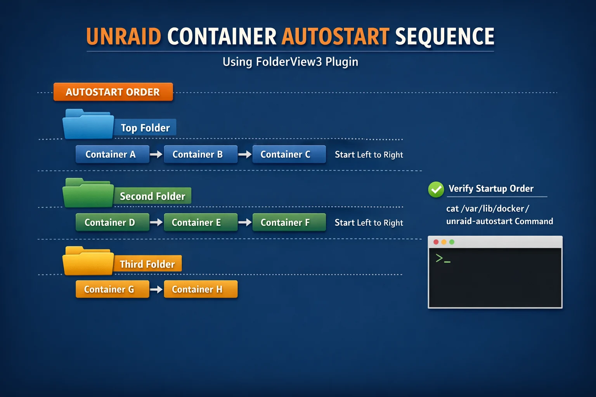
- **Compose & 3rd Party awareness** — handles Docker Compose and 3rd party containers
- **Folder name length warning** — warns when names exceed 20 characters to prevent layout issues
- **CSS Tool** — built-in theme manager with GitHub import, variable editor, presets, and advanced CSS
- **Theme update checker** — detects when imported GitHub themes have updates, Docker-style indicators
- **Folder defaults** — set global defaults for preview, overflow, context, and more — apply to all folders in one click
- **Full backup/restore** — export everything (folders, settings, CSS config, themes) to a single JSON file
- **Custom CSS/JS extensions** — full theming support with 40+ CSS variables
- **Security warnings** — CSS imports are scanned for external URLs and flagged for user review
- **Incognito mode** — blur container names, icons, Tailscale IPs, public IPv6 addresses, MAC addresses, and container references in volume paths for screenshot-safe sharing

  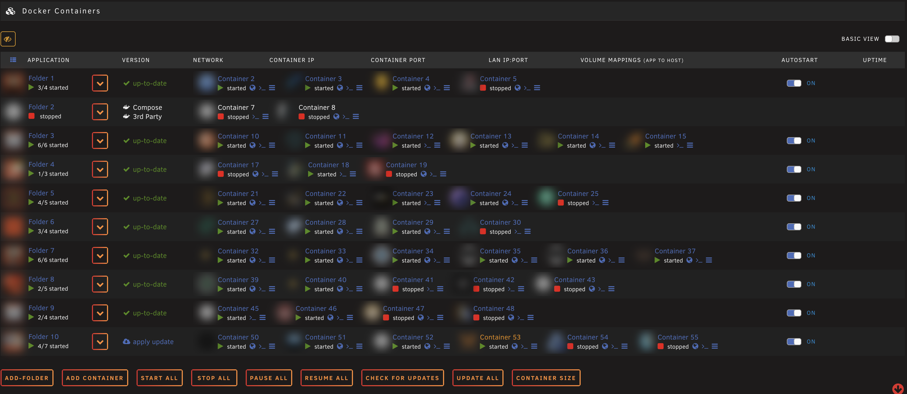

- **7 languages** — English, German, Spanish, French, Italian, Polish, Chinese
- **Debug mode** — type `fv3debug` on any page to toggle console logging

## Installation

Paste this URL into **Plugins → Install Plugin**:

```
https://raw.githubusercontent.com/chodeus/folder.view3/main/folder.view3.plg
```

For the beta channel:

```
https://raw.githubusercontent.com/chodeus/folder.view3/beta/folder.view3.plg
```

### Migrating from folder.view / folder.view2

1. Export All (Docker + VM) from old plugin's settings page
2. Backup custom CSS from `config/plugins/folder.view3/styles/`
3. Uninstall old plugin, install this fork
4. Import exported files, restore custom CSS

## Getting Started

After installation, an **Add Folder** button appears at the bottom of the Docker and VM tabs.

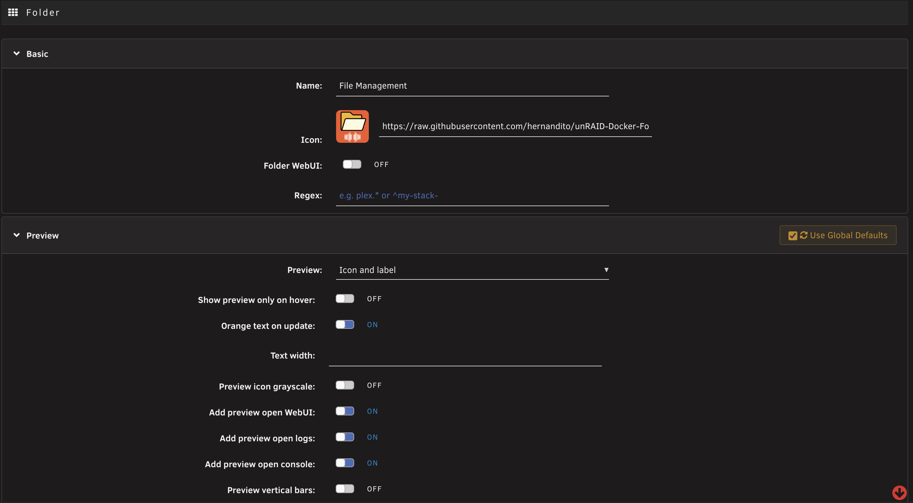

### Assigning containers to folders

1. **Manual selection** — pick containers when creating/editing a folder
2. **Regex matching** — auto-assign containers whose names match a pattern (e.g. `^media-.*` or `*my-stack-`)
3. **Docker label** — add `folder.view3: "FolderName"` to any container:
   ```yaml
   services:
     myapp:
       labels:
         folder.view3: "MyFolder"
   ```

## Settings Page

The plugin settings page (**Settings > FolderView3**) is organized into collapsible sections:

- **Dashboard Configuration** — layout style, animation, greyscale, collapse toggles (per-section for Docker and VMs)

  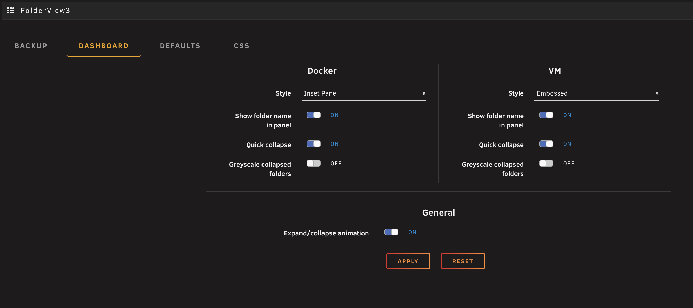
- **Folder Defaults** — global defaults for preview mode, overflow, context, icons, borders, separators. New folders inherit these automatically. "Apply Defaults to All" updates every existing folder.

  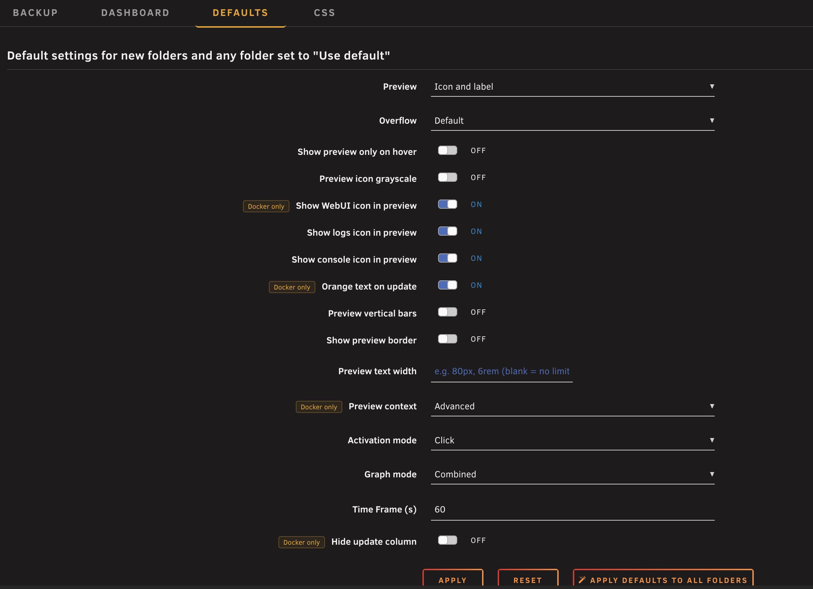

- **Import / Export (Backup)** — full backup (everything in one JSON), individual Docker/VM export/import, danger zone (clear all)
- **Custom CSS** — four tabs:
  - **Themes** — import community CSS from GitHub, enable/disable, one-click updates with change detection
  - **Variables** — edit 27 CSS variables with color pickers and sliders, scoped per page
  - **Presets** — one-click theme presets (Default, Compact, Blue Accent, Muted)
  - **Advanced CSS** — free-form CSS editor with live preview

  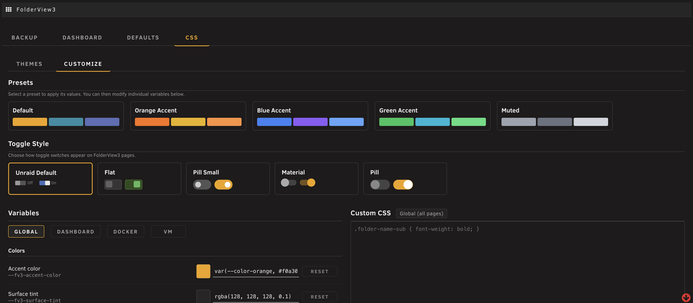

### Importing Community Themes

Enter a GitHub repo (e.g. `masterwishx/folder.view.custom.css`) in the Themes tab. If the repo has multiple directories, a picker lets you select which to import. Imported themes show update status — green checkmark for up-to-date, blue cloud when updates are available.

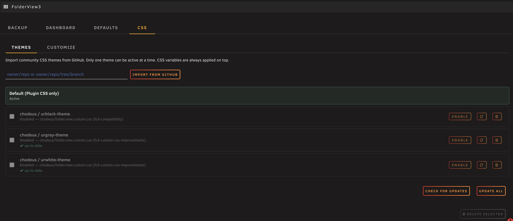

## Custom CSS/JS

FolderView3 supports custom CSS and JavaScript extensions. Place files in:

- **CSS:** `/boot/config/plugins/folder.view3/styles/`
- **JS:** `/boot/config/plugins/folder.view3/scripts/`

Files follow the pattern `name.tab.css` where `tab` is `docker`, `vm`, `dashboard` (chain with `-` for multiple tabs).

A [CSS template](dev/examples/custom-template.css) is included as a starting point. See the [Developer Guide](dev/README.md) for the full CSS variables reference, DOM structure, and JS events API.

### CSS Variables (Quick Reference)

```css
:root {
    /* Colors */
    --fv3-accent-color: var(--color-orange, #f0a30a);
    --fv3-surface-tint: rgba(128, 128, 128, 0.1);
    --fv3-hover-bg: rgba(128, 128, 128, 0.2);
    --folder-view3-graph-cpu: #2b8da3;
    --folder-view3-graph-mem: #5d6db6;

    /* Folder appearance */
    --fv3-folder-preview-bg: transparent;
    --fv3-folder-name-bg: transparent;
    --fv3-folder-preview-height: 3.5em;
    --fv3-preview-icon-size: 32px;
    --fv3-scrollbar-color: rgba(255, 140, 47, 0.5);

    /* Dashboard */
    --fv3-toggle-color: #ff8c2f;
    --fv3-panel-border: rgba(128, 128, 128, 0.2);
    --fv3-panel-bg: rgba(128, 128, 128, 0.08);
}
```

### Community Themes

- [hernandito](https://github.com/hernandito/folder.view.custom) — Compact and Midsize designs
- [Mattaton](https://github.com/Tyree/folder.view.custom.css) — urblack, urgray, urwhite themes
- [masterwishx](https://github.com/masterwishx/folder.view.custom.css) — urblack with CSS variables

## Unraid 7.2+ API

On Unraid 7.2+, FolderView3 automatically detects and uses the GraphQL API for:

- **Container actions** — start/stop/restart/pause via GraphQL mutations with PHP fallback
- **Real-time stats** — WebSocket subscription replaces SSE for lower latency
- **Update checking** — container update status via API
- **Organizer sync** — folder structure automatically syncs to Unraid's native Docker Organizer when available

All features fall back gracefully on older Unraid versions — no configuration needed.

## Debug Mode

Type **fv3debug** on any FolderView3 page to toggle debug logging. Console shows folder creation, API calls, organizer sync activity, and stats updates with `[FV3]` prefix. State persists across page loads.

For PHP server-side debug: `touch /tmp/fv3_debug_enabled` on the Unraid console. Logs write to `/tmp/folder_view3_php_debug.log`.

## Project History

Originally created by [scolcipitato](https://github.com/scolcipitato/folder.view), ported to Unraid 7 by [VladoPortos](https://github.com/VladoPortos/folder.view2), actively maintained by [chodeus](https://github.com/chodeus/folder.view3).

## Support

- **Unraid Forum:** [FolderView3 Support Thread](https://forums.unraid.net/topic/197223-plugin-folderview3/)
- **GitHub Issues:** [chodeus/folder.view3](https://github.com/chodeus/folder.view3/issues)

## Libraries

- [Chart.js](https://www.chartjs.org/)
- [chartjs-adapter-moment](https://github.com/chartjs/chartjs-adapter-moment)
- [Moment.js](https://momentjs.com/)
- [chartjs-plugin-streaming](https://github.com/nagix/chartjs-plugin-streaming)
- [jquery.i18n](https://github.com/wikimedia/jquery.i18n)
- [jQuery UI MultiSelect](https://github.com/ehynds/jquery-ui-multiselect-widget)

## Credits

- [scolcipitato](https://github.com/scolcipitato) — original creator
- [VladoPortos](https://github.com/VladoPortos) — Unraid 7 port and maintenance
- [bmartino1](https://github.com/bmartino1) — testing and feedback
- [Masterwishx](https://github.com/masterwishx) — testing and feedback

## License

The original codebase (scolcipitato/folder.view, VladoPortos/folder.view2) is unlicensed. This license applies to contributions made in this fork only.
